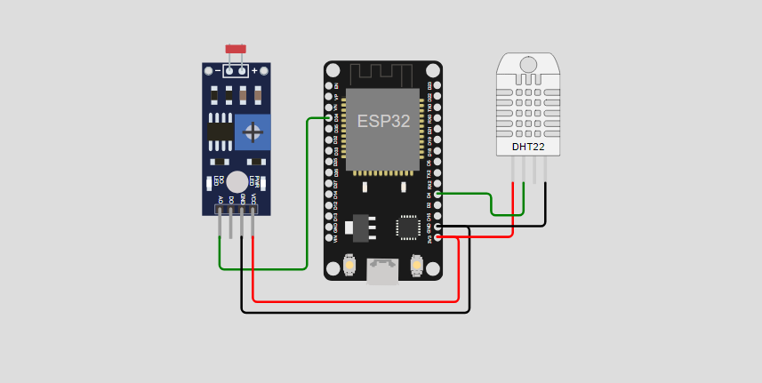

# Controle de LED e Monitoramento de Dados do Ambiente com ESP32 e MQTT

<h3>
    Este programa para o ESP32 permite controlar um LED onboard e enviar o status do LED para um Broker MQTT. Além disso, o programa realiza a leitura da temperatura e umidade utilizando um sensor DHT22, publicando esses valores em tópicos apropriados no Broker MQTT. 
</h3>

  <a href="#participantes">Participantes</a> |
  <a href="#funcionalidades">Funcionalidades</a> |
  <a href="#configuração">Configuração</a> |
  <a href="#bibliotecas-necessárias">Bibliotecas Necessárias</a> |
  <a href="#uso">Uso</a> |
  <a href="#aviso">Aviso</a> 

## Participantes
* João Henrique Sena Hoffmann (RM550763)
* Lucas Ludovico Cabral (RM554589)
* Rafael Teofilo Lucena (RM555600)
* Vinicius Fernandes Tavares Bittencourt (RM558909)
* Weslley Oliveira Cardoso (RM557927)

## Funcionalidades

- **Controle de LED**: Liga e desliga o LED onboard do ESP32.
- **Comunicação MQTT**: Envia e recebe mensagens via MQTT para controle do LED e monitoramento de luminosidade.
- **Leitura de Luminosidade**: Realiza a leitura do valor de luminosidade e publica em um tópico MQTT específico.
- **Leitura de Temperatura e Umidade**: Realiza a leitura dos valores de temperatura e umidade e publica esses dados em tópicos MQTT específicos.

## Configuração

Antes de executar o código, você precisa configurar as seguintes variáveis:

- `SSID`: Nome da rede Wi-Fi.
- `PASSWORD`: Senha da rede Wi-Fi.
- `BROKER_MQTT`: IP do Broker MQTT.
- `BROKER_PORT`: Porta do Broker MQTT (padrão 1883).
- `TOPICO_SUBSCRIBE`: Tópico MQTT para escuta de comandos.
- `TOPICO_PUBLISH_1`: Tópico MQTT para envio do status do LED.
- `TOPICO_PUBLISH_2`: Tópico MQTT para envio do valor de luminosidade.
- `TOPICO_PUBLISH_3`: Tópico MQTT para envio da temperatura.
- `TOPICO_PUBLISH_4`: Tópico MQTT para envio da umidade.
- `ID_MQTT`: ID do cliente MQTT.
- `D4`: Pino do LED onboard (padrão 2 para ESP32).

## Bibliotecas Necessárias

Certifique-se de ter as seguintes bibliotecas instaladas no seu ambiente de desenvolvimento:

- `WiFi` (para conexão com a rede Wi-Fi)
- `PubSubClient` (para comunicação MQTT)
- `DHT` (para leitura do sensor de temperatura e umidade)

## Uso

1. **Configuração do Wi-Fi**: O ESP32 se conecta à rede Wi-Fi especificada nas variáveis `SSID` e `PASSWORD`.
2. **Conexão MQTT**: O ESP32 se conecta ao Broker MQTT especificado em `BROKER_MQTT` e `BROKER_PORT`.
3. **Controle do LED**: 
   - Envie a mensagem `lamp1992@on|` para o tópico `TOPICO_SUBSCRIBE` para ligar o LED.
   - Envie a mensagem `lamp1992@off|` para o mesmo tópico para desligar o LED.
4. **Leitura de Temperatura e Umidade**: Os valores de temperatura e umidade são lidos e publicados nos tópicos `TOPICO_PUBLISH_3` e `TOPICO_PUBLISH_4`, respectivamente.
5. **Leitura de Luminosidade**: O valor da luminosidade é lido e publicado no tópico `TOPICO_PUBLISH_2`.

## Aviso

Adapte as informações conforme necessário, especialmente os detalhes de contato e qualquer outra configuração específica.